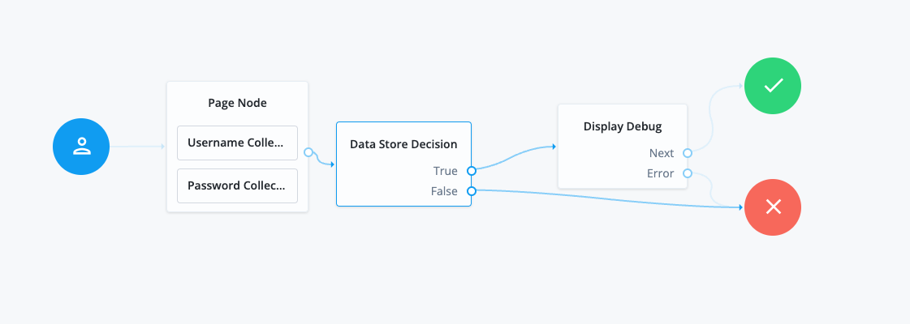

<!--
 * The contents of this file are subject to the terms of the Common Development and
 * Distribution License (the License). You may not use this file except in compliance with the
 * License.
 *
 * You can obtain a copy of the License at legal/CDDLv1.0.txt. See the License for the
 * specific language governing permission and limitations under the License.
 *
 * When distributing Covered Software, include this CDDL Header Notice in each file and include
 * the License file at legal/CDDLv1.0.txt. If applicable, add the following below the CDDL
 * Header, with the fields enclosed by brackets [] replaced by your own identifying
 * information: "Portions copyright [year] [name of copyright owner]".
 *
 * Copyright 2022 ForgeRock AS.
-->
# Enhanced Debug Node

A simple authentication node for ForgeRock's [Identity Platform][forgerock_platform] 7.2.0 and above. This node is used 
for debugging a user journey. In the admin configuration, the admin can choose whether to display 
the node or not, is able to insert Key: Value pairs into Shared State / edit items in the Shared State while 
seeing what values are for AuthID, HTTP Request Headers, ClientIP, Cookies, Hostname, Locales, Parameters,
and the Server URL. 

Copy the .jar file from the ../target directory into the ../web-container/webapps/openam/WEB-INF/lib directory where AM is deployed.  Restart the web container to pick up the new node.  The node will then appear in the authentication trees components palette.

## Inputs

`None`
## Configurations

<table>
<thead>
<th>Property</th>
<th>Usage</th>
</thead>
<tr>
    <td>Enable</td>
    <td>Choose whether to display node or not</td>
</tr>
<tr>
    <td>2 or more Debug nodes in journey and using ForgeRock UI?</td>
    <td>If there is one instance of this node in the journey, leave as False. If there are more than one change True</td>
</tr>
<tr>
    <td>Insert into shared state</td>
    <td>This is used to insert Key: Value pairs into the shared state via user input in the journey</td>
</tr>
<tr>
    <td>Number of Key:Value pairs</td>
    <td>Choose how many Key: Value pairs you want. (Default: "1")("0" to not display)</td>
</tr>
<tr>
    <td>Using ForgeRock UI</td>
    <td>Choose to use javascript formatting or if using native</td>
</tr>
<tr>
    <td>Shared State</td>
    <td>Debug Shared State</td>
</tr><tr>
    <td>AuthID</td>
    <td>This is typically available after the first call to the authentication</td>
</tr><tr>
    <td>HTTP Request Headers</td>
    <td>The HTTP headers from the current authenticate HTTP request</td>
</tr><tr>
    <td>Client IP</td>
    <td>The User IP address</td>
</tr><tr>
    <td>Cookies</td>
    <td>The Cookies from the current journey</td>
</tr><tr>
    <td>Hostname</td>
    <td>User Hostname</td>
</tr><tr>
    <td>Locales</td>
    <td>Locales of User journey</td>
</tr><tr>
    <td>Parameters</td>
    <td>Parameters of User journey</td>
</tr><tr>
    <td>Server Url</td>
    <td>Url of the server where User is requesting service from</td>
</tr>
</table>

## Outcomes

`Next`

Node displays user chosen values in the configurations and will continue in the journey

`Error`

An error occurred causing the request to fail. Check the response code, response body, or logs to see more details of the error. 

## Outputs

Key : Value pair in Shared State depending on if user inserts into Shared State or not
## Examples

